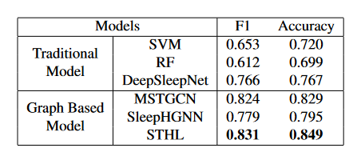

### Exploitting Spatial-Temporal Data for Sleep Stage Classification via Hypergraph Learning

Our paper has been accpeted by IEEE ICASSP 2024, please refer to [Arxiv](https://arxiv.org/pdf/2309.02124) for the latest version.


### Requirements

- Python 3.10
- Pytorch 1.13.1
- CUDA 11.7

### Dataset
We apply the ISRUC dataset Subject 3 from [ISRUC](https://sleeptight.isr.uc.pt/), and we share a feature extracted version of data at [Google Drive](https://drive.google.com/file/d/1cwFmtS1IhaAalSLYy8dj_aFvLeJBJo32/view?usp=sharing).

### How to run the code
Please first download the dataset with the provided script, if you directly download the data from our goolge drive link, feel free to skip the following two steps.

```
bash ./ISRUC_S3.sh
```

Run the preprocessing step to extract channels and labels from PSG signal,
```
python ./preprocess.py
```


Use default setting (tuned to best reported result) to run the STHL Model
```
python ./run.py
```

### Evaluation Result


